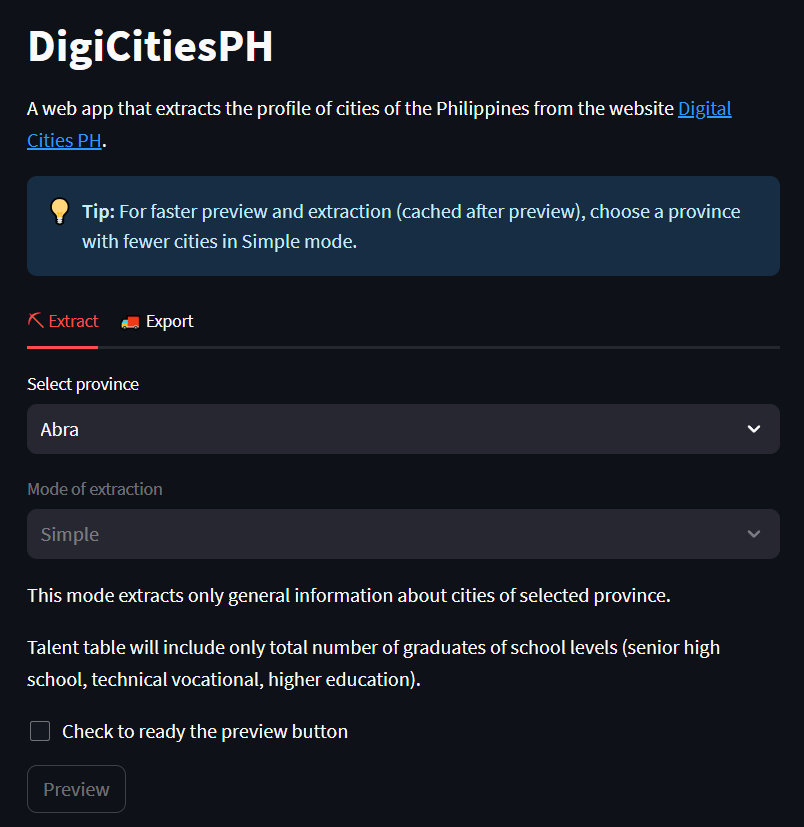

# 🏙 digicitiesph 

A Streamlit web app that extracts the profile of cities of the Philippines from the website Digital Cities PH.

# Features

* [X] Select one of 81-82 provinces of the Philippines and extract the Talent, Infrastructure, Business Environment and Digital Parameter data of all the cities/municipalities under it.
* [X] Preview extracted datasets before exporting
* [X] APA Format Citation for the data source Digital Cities PH.
* [X] Export to Excel with worksheets
* [ ] Export to CSV files in zip
* [X] Simple Extraction Mode (general details)
* [ ] Advanced Extraction Mode (more details)
* [X] Post elapsed time on successful extraction

# Screenshot

# Benchmark Test

* Select provinces "Batanes" or "Guimaras" for short benchmark test
* Select provinces "Bohol" or "Cebu" for long benchmark test
